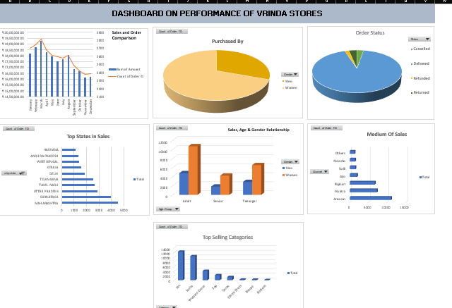

# Data-visualisation-X-Sales-report
Retail sales analytics dashboard built in Excel — analyzing 31,000+ orders across product categories, sales channels, customer demographics, and order fulfillment using pivot tables and interactive charts.

# Vrinda Store Sales Analytics Dashboard

Retail sales analytics on 31,047 orders (₹2.12 Cr total sales) — built in 
Excel using pivot tables and an interactive multi-chart dashboard covering 
product performance, sales channels, customer demographics, and regional trends.

## Tools
Excel — Pivot Tables, Pivot Charts, Dashboard Design

## Key Insights
1. Heavy product concentration — "Set" and "Kurta" together account for 74% of all orders (22,837 of 31,047), meaning the business relies on just two product lines while the remaining six categories share the rest.
2. Customer base skews strongly female — women placed 69% of all orders (21,553 vs. 9,494 for men), a near 2.3:1 ratio consistent across all age groups.
3. Sales softened through the year — monthly sales peaked in March (₹19.3L) and declined steadily to a November low (₹16.2L), a ~16% drop from peak to trough, pointing to seasonal demand weakening in H2.

## Dashboard Preview

